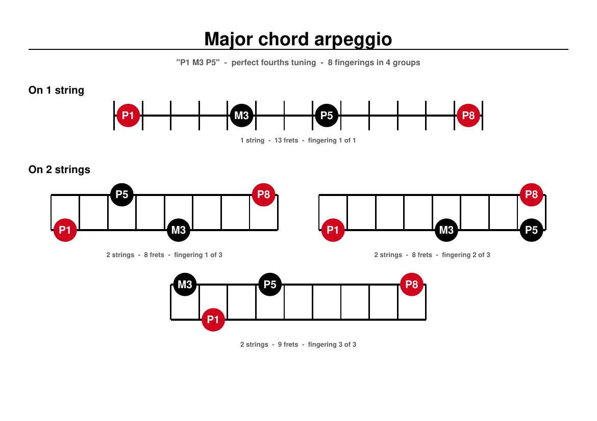
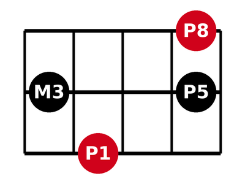
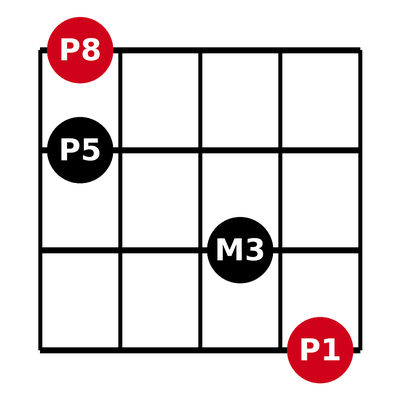

# Perfect fourth tuning interval sequence visualization

Interval sequence visualizer for fretted instruments in **perfect fourth tuning**
(all-fourths: E–A–D–G–C–F …). Give it an interval sequence such as `P1 M3 P5` and
it produces a PDF chart of **every standard fingering** of that sequence on the
fretboard, grouped by the number of strings used — and optionally saves each
shape as a PNG or SVG image.



In fourths tuning, fingering patterns repeat across the fretboard by translation,
so each chart shows only the repeated pattern: the root position is deliberately
unspecified, and every shape is cropped to its own minimal bounding box.

```shell
./sequence_visualiser.py "P1 M3 P5" --title "Major chord arpeggio" --images
```

```
chart "P1 M3 P5"
  on 1 string: 1 fingering
  on 2 strings: 3 fingerings
  on 3 strings: 3 fingerings
  on 4 strings: 1 fingering
  total: 8 fingerings
  pdf:   …/Major chord arpeggio/Major chord arpeggio.pdf
  images: 8 files (png) in …/Major chord arpeggio/images
```

## How fingering is modelled

In perfect fourths tuning the next higher-sounding string is 5 semitones above
the current one at the same fret, so a note *s* semitones above the root, played
on string row *r* (negative = higher-sounding string), sits at fret offset

```
f = s + 5·r
```

A fingering — a "standard box" — is a **monotone string path**: as the pitch
ascends, each note either stays on its string or moves to the next
higher-sounding string, one string at a time. For N notes (root, your
intervals, octave) this gives exactly **2^(N−1) fingerings**; the number of
strings used is (string moves + 1). Frets are normalized to the shape's own
bounding box because the pattern is transposable.

For `P1 M3 P5` that yields 8 fingerings in 4 groups:

| Shape | Frets (root → octave) |
|---|---|
| 1 string | 0 – 4 – 7 – 12 |
| 2 strings × 3 | e.g. 0, 4 – 2, 7 |
| 3 strings × 3 | the classic box: 0, 4 – 2 – 2 |
| 4 strings | the diagonal 3 – 2 – 0 – 0 |




## Chart conventions

- Shapes are horizontal; **lower-sounding strings at the bottom**, higher at the top
- Root (**P1**) and octave (**P8**, added automatically) are **red**; all other
  notes are **black**, each labeled with its interval name in white inside the dot
- Strings and frets are black on a white (opaque) background
- Single-string shapes are drawn as a fret ladder crossing the string
- PDF: A4 landscape, chapter-style title on page 1, one section per string
  count (`On 3 strings` …), each shape captioned with its fret span and fingering index

## Install & requirements

- Python 3.8+ — the script is standalone, no third-party packages required
- [Pillow](https://python-pillow.org) only if you save PNG images
  (`--images` with the default format); SVG and PDF output are dependency-free

```shell
chmod +x sequence_visualiser.py   # if needed
./sequence_visualiser.py --help
```

## Usage

```
sequence_visualiser INTERVALS... --title TITLE [--images] [--format {png,svg}] [--dir DIR]
```

| Option | Description |
|---|---|
| `INTERVALS...` | the interval sequence, quoted or as separate arguments (space or comma separated), e.g. `"P1 M3 P5"` |
| `-t, --title TITLE` | chart title; names the output folder and PDF (required) |
| `--images` | also save every shape as an image in an `images/` subfolder |
| `-f, --format {png,svg}` | image format for `--images` (default: `png`) |
| `-o, --dir DIR` | output root folder (default: the folder containing the executable) |

Output goes to `<dir>/<title>/<title>.pdf` plus `<dir>/<title>/images/` when
`--images` is given.

### Interval names

Case matters — `m3` and `M3` are different intervals.

| Semitones | Names | | Semitones | Names |
|---|---|---|---|---|
| 0 | `P1` | | 7 | `P5` |
| 1 | `m2` | | 8 | `A5` `m6` |
| 2 | `M2` | | 9 | `M6` |
| 3 | `A2` `m3` | | 10 | `A6` `m7` |
| 4 | `M3` | | 11 | `M7` |
| 5 | `A3` `P4` | | 12 | `P8` — the octave |
| 6 | `A4` `d5` `TT` | | | |

`P8` is never part of the input — it is added automatically as the finish note
of every shape.

### Input rules

- the sequence must start with `P1` and contain at least one more interval
- intervals must strictly increase, with no two sharing the same semitone count
  (so `A2 m3` is rejected, as is any repeat)
- the final interval must be smaller than an octave, which caps the sequence at
  12 intervals

Invalid input exits with status 1 and a message that includes the valid names.

## More examples

```shell
./sequence_visualiser.py "P1 m3 d5 m7" -t "Half-diminished 7th chord arpeggio" --images
./sequence_visualiser.py "P1 M2 m3 P4 d5 P5 m7" -t "Blues scale"
./sequence_visualiser.py P1 m3 P5 -t "Minor triad" --images --format svg
```

The [`example/`](example/) folder contains ready-made charts generated with this
tool: **72 chord arpeggios** (`example/arpeggio/`) and **69 scales and modes**
(`example/scales/`) — every chord and scale commonly spelled within one octave,
from triads and seventh chords to folded ninths, elevenths and thirteenths,
bebop scales, Indian thats and the symmetric Messiaen modes.

## Limitations

- Perfect fourth tuning only (constant 5-semitone string spacing)
- One octave window: the last input interval must be below `P8`, so extended
  chords are spelled as their within-octave pitch-class equivalents
  (9ths as `M2`, ♭9 as `m2`, ♯9 as `m3`, 6/9 as `M2 … M6`, ♯11 as `A4`,
  diminished 7th as `M6`, …) — same notes, folded down
- Playability is not filtered: the chart is exhaustive over monotone string
  paths, including string-by-string diagonals that need extended-range
  instruments for long sequences

## Files

- `sequence_visualiser.py` — the whole program (a single executable script)
- `example/` — generated chart library (28 chords, 43 scales)
- `docs/` — images used by this README
